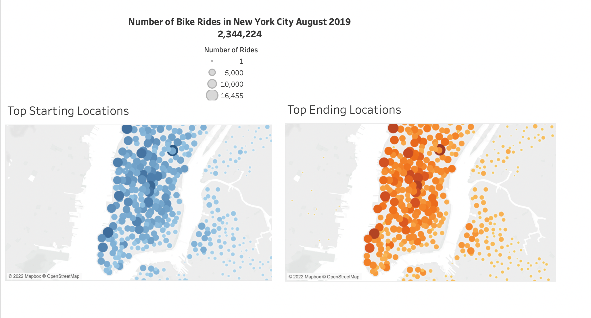
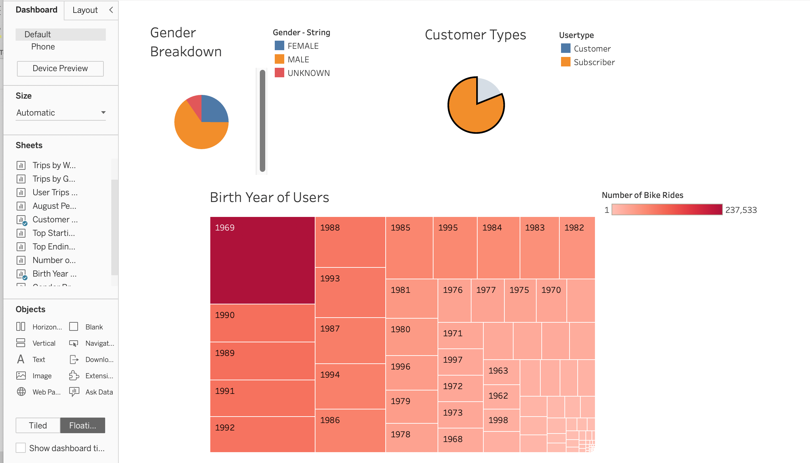
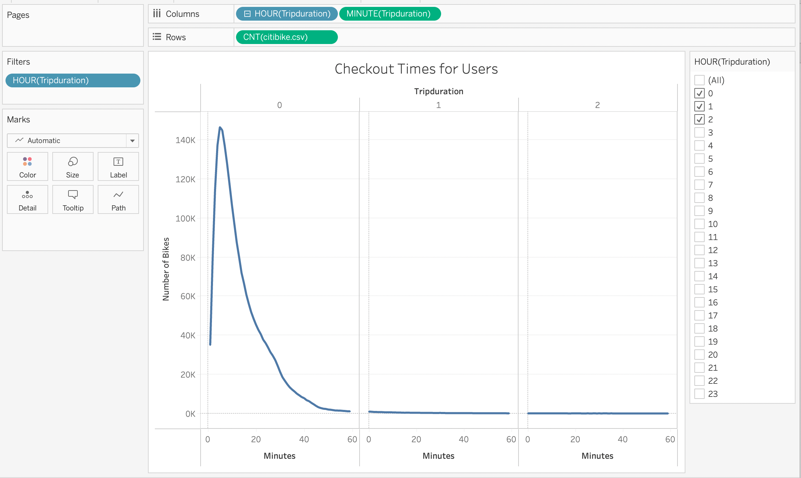
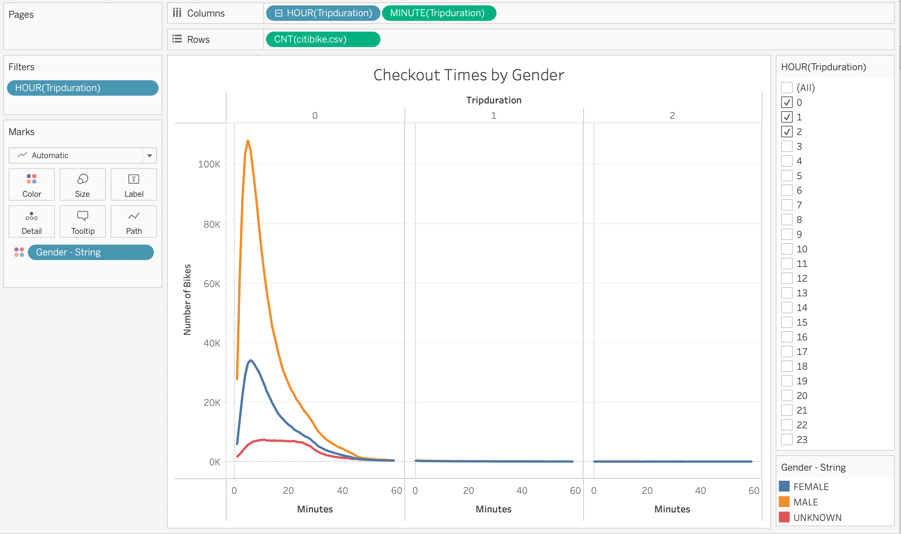
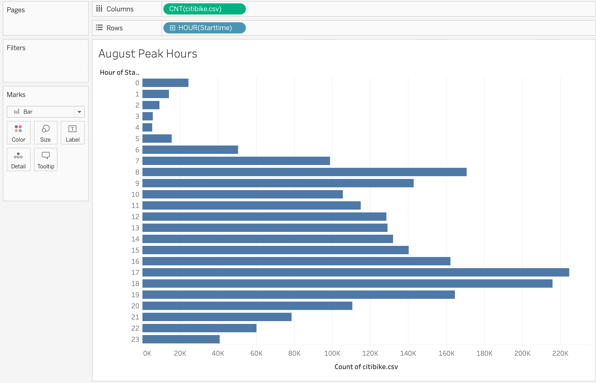
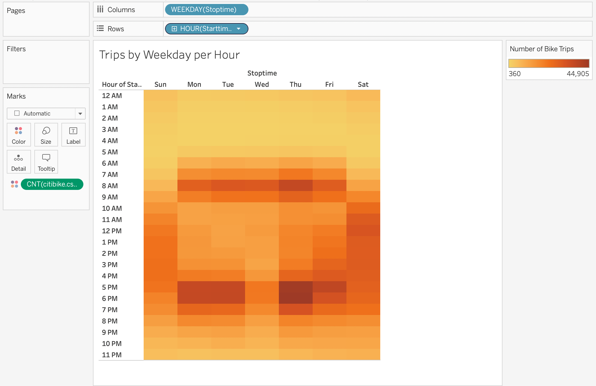
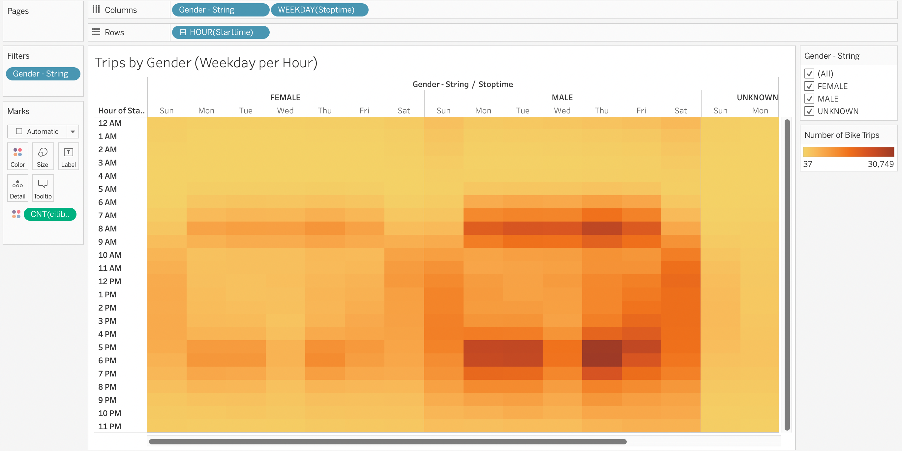
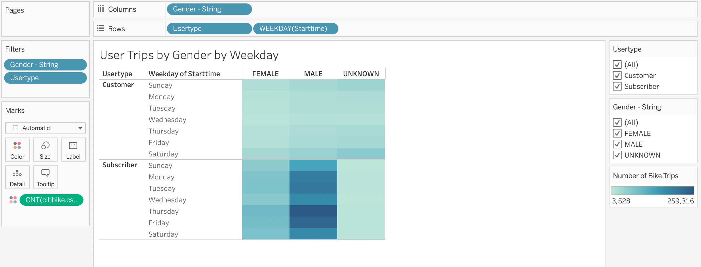

# NY Citibike Sharing with Tableau

## Overview of the Analysis 
After a fun trip to New York using a bike sharing service called Citibike, a couple of friends would like to open a bike sharing business in Des Moines, Iowa. 

One of the friends got in contact with an angel investor who might be interested in providing seed funding to explore a bike-share program in Des Moines.

It is decided that the first step is to figure out how the bike-share business actually works in NYC and convince investors that a bike-sharing program in Des Moines is a solid business proposal. 

Using the 201908-citibike-tripdata.csv a few visualizations were created.

Now, to solidify the proposal, one of the key stakeholders would like to see a bike trip analysis.
For this analysis, Pandas will be used to change the "tripduration" column from an integer to a datetime datatype. Then, using the converted datatype, a set of visualizations will be created to:

* Show the length of time that bikes are checked out for all riders and genders
* Show the number of bike trips for all riders and genders for each hour of each day of the week
* Show the number of bike trips for each type of user and gender for each day of the week.

Finally, these new visualizations in addition to two of the earlier visualizations will be added to the final presentation and analysis to pitch to investors.

## Analysis Process 

### Changed Trip Duration to a Datetime Format
Used Python and Pandas functions, to convert the "tripduration" column from an integer to a datetime datatype to get the time in hours, minutes, and seconds (00:00:00). After the "tripduration" column is converted to a datetime dataytpe, exported the DataFrame as a CSV file to use for the trip analysis and Tableau visualizations. 

To see how this was done, please see the following files: 
* [NYC_CitiBike_Challenge](NYC_CitiBike_Challenge.ipynb)

### Created Visualizations for the Trip Analysis
UsedTableau, to create visualizations that show:

* How long bikes are checked out for all riders and genders.
* How many trips are taken by the hour for each day of the week, for all riders and genders.
* A breakdown of what days of the week a user might be more likely to check out a bike, by type of user and gender.

To see how this was done please see the following Tableau Public Link: 

[Link To Tableau Story](https://public.tableau.com/app/profile/zahra8438/viz/NYCitibikeStory_16494697199140/NYCitibikeStory?publish=yes) 

### Created a Story and Report for the Final Presentation
Created a story in Tableau and wrote a report that describes the key outcomes of the NYC Citibike analysis. 

To see how this was done please see the story with the following Tableau Public Link: 

[Link To Tableau Story](https://public.tableau.com/app/profile/zahra8438/viz/NYCitibikeStory_16494697199140/NYCitibikeStory?publish=yes) 

## Results 
The finalized story contained the following images. 

### Story Point 1 - Number of Bike Rides in New York City August 2019 

The first visualization of the story is a Tableau dashboard which contains visualizations that were created in the initial analysis. The dashboard contains the number of bike rides in New York City in August 2019, as well as the top starting locations and the top ending locations. The visualization is meant to show investors how frequently bikes are were used in New York City and draw them in to wanting more information about the bike sharing data. Top Starting Locations shows where bike riders picked up their bikes to start their trip. Top Ending Locations shows where bike riders dropped off their bikes at the end of the trip. Both maps show that bikes are used all over the city, but there are more bike rides closer to the water. 

### Story Point 2 - Customer Breakdown 

The second visualization of the story is a Tableau dashboard which contains visualizations that were created in the initial analysis, as well as one additional visualization. The dashboard contains the gender beakdown of riders, the customer type, and the birth year of users. The visualization is meant to provide an overview of customers who use the bike sharing service. The Gender breakdown pie chart shows that majority of riders were male. The customer type pie chart shows that majority of riders were annual subscribers. This may be an attractive to investors as it shows that individuals in NYC are commited to the bike sharing service, and use it frequently. It also could potentially mean consistent revenue for the business. The Birth Year of Users shows that the customer base consists of a diverse range of ages, with most frequent users being born in 1969. However, younger riders also ride fairly frequently. Older users tend to use the service only one time or on a handful of occasions. 

### Story Point 3 - Checkout Times for Users 

The third visualization shows a line graph to demonstrate the number of rides versus trip duration. The converted Trip Duration data in Pandas was used here to help segment the trip duration times.The number of rides is on the y-axis, and the length of rides on the x-axis. The top x-axis shows the trip duration by hours, the bottom of the graph shows trip duration by minutes. The line graph can be filtered by hours of the trip duration. The visualization shows the majority of rides were about 5 minutes long (146,752 rides at this duration) and most rides were less than an hour long. This demonstrates that riders use the service to get to place from place, rather than a leisurely long ride. However, when considering situations like commuting to work, this can be a more sustainable use of the service. 

### Story Point 4 - Checkout Times By Gender 

The fourth visualization shows a multi-line graph to demonstrate the number of rides versus trip duration for each gender. The converted Trip Duration data in Pandas was used here to help segment the trip duration times. The number of rides is on the y-axis, and the length of rides on the x-axis. The top x-axis shows the trip duration by hours, the bottom of the graph shows trip duration by minutes. The orange line represents male riders, the blue line represents female riders, and the red line represents unknown gender riders. The line graph can be filtered by hours of the trip duration as well as gender. The visualization shows the pattern of trip duration for male and females are similar. However, females peak ride frequency is 6 minutes (34,151 female rides at this duration), while for males it is 5 minutes (108,087 ). As mentioned earlier, there are more male riders, this visualization further defines that. Unkown gender riders have a bit of a different pattern, with a peak at 12 minutes (7,389 rides) and the ride frequency kind of plateaus afterwards instead of dropping (like male and female riders). This reinforces that most people have a shorter ride time, and may imply that unkown gender riders may be riding more leisurely. 

### Story Point 5 - August Peak Hours

The fifth visualization was created in the initial analysis and shows the peak riding hours in August. It is a horizontal bar chart with the number of bike rides on the x-axis and the hour of the day the bike ride started on the y-axis. The visualiztion shows that majority of rides started at 5:00pm (224,566 rides), 6:00pm (215,783 rides), and 7:00am (170,730 rides). 

### Story Point 6 - Trips by Weekday per Hour

The sixth visualization is meant to provide a deep dive from the fifth visualization by showing the peak riding hours during the week day. It is a heatmap with the number of bike rides as the colour and the hour of the day the bike ride started on the y-axis. The deeper the red, the more frequency of rides that started at the specified hour. The visualiztion shows the following abot the previously noted peak ride hours:
* 5:00pm (224,566 rides) - At this start time, most rides were on Thursdays (44k rides), Mondays (36k rides) and Wednesdays(36k rides).
* 6:00pm (215,783 rides) - At this start time, most rides were on Thursdays (45k rides), Mondays (36k rides) and Wednesdays (36k rides). 
* 7:00am (170,730 rides) - At this start time, there is a pretty consistent frequency of rides from Monday - Friday (between  27k - 36k rides, Thursday being the highest).

Overall it appeared Thursdays at 6:00pm had the most rides overall. 

One thing to note is that Saturdays aalso had a decent amount of rides consistently between 10:00am - 6:00pm (with a range of about 24k to 29k rides). 

### Story Point 7 - Trips by Weekday by Gender

The sixth visualization is meant to provide a deep dive from the fifth visualization by showing the peak riding hours during the week day by breaking it down by gender. It is a heatmap with the number of bike rides as the colour and the hour of the day the bike ride started on the y-axis. The deeper the red, the more frequency of rides that started at the specified hour. The heatmap can be filtered by gender. The map shows that femal rides during the week mimick male drives during the week, but at less frequency. The heatmap also shows that unknown gender had more rides during the weekends than during the weekdays which further reinforces the fact that they may be more leisurely riders or one-time riders. 

### Story Point 8 - Usertrips by Gender by Weekday

The seventh visualization shows the number of rides by customer type, weekday and Gender. It is a heatmap with the number of bike rides as the colour, the Weekday are the rows and the rows are further broken down into two parts - the Customer usertype and the Subscriber user type. The columns are the Genders. The deeper the blue, the more frequency of rides. The heatmap can be filtered by gender and by customer type. The map shows that male subscribers are the most frequent riders with most rides on Thursday (259,316 rides), but pretty consistenty ride throughout the week.
Most female riders are also subscribers and have the most rides on Thursday (88, 281 rides). Unkown gender riders are mostly customers and have the most rides on Saturday (55,375).

## Summary 
In summary, in August 2019, most rides were by male subscribers. Thursdays at 6:00pm had the most rides for female and male subscribers. While unkown genders did not have as many rides, it can be presumed they make up a decent amount of leisurely rides (and make up most of the one-time customers). 

Overall this data shows that the Citibike service was used frequently in August and are great for both commuting between areas (anyday during the week - but especially during peak rush hour times) and are also a great way to travel and spend leisurely time. There are far more subscribers than one-time users which shows there is a commitment to the service. This would be a great addition to Des Moines, Iowa.

A few additional visualizations could be created for future analysis. A few suggestions are below:

* The number of rides stopping and ending at different Stations (to further analyze which areas in the city draw the most rides) - perhaps this can be an indication of where initial bike stations should be placed in Des Moines, Iowa. This can possibly be shown as a map or bar graph.

* Consumer type by Birth Year - to see which age groups tend to be subscribers versus one-time customers. This can possibly be shown as a bar graph. 
